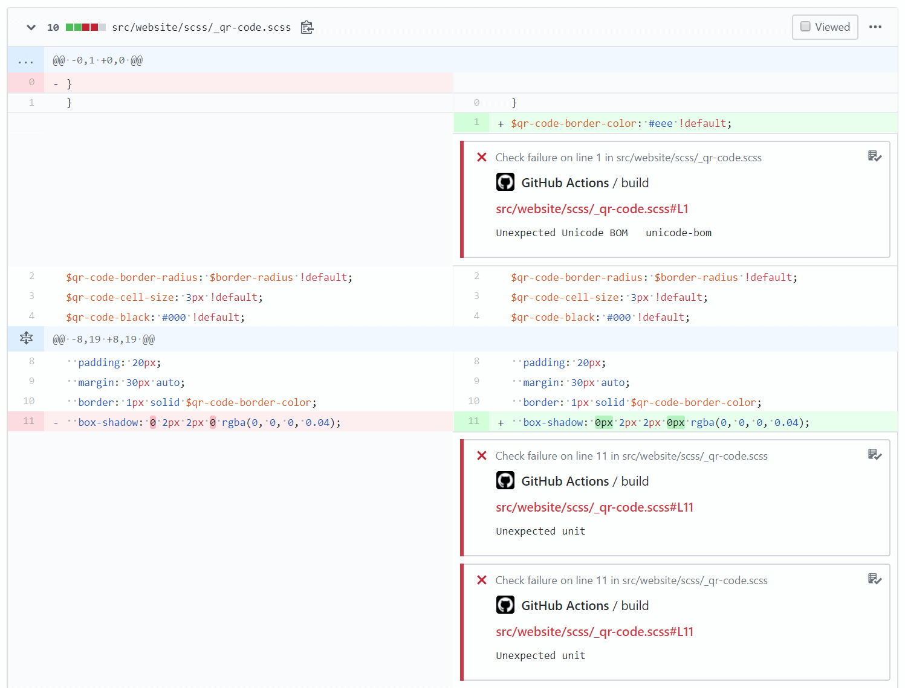
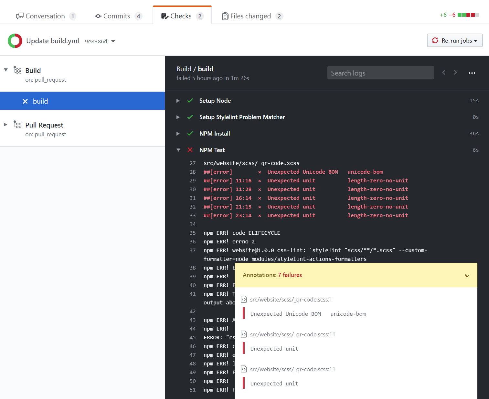

# Stylelint Problem Matcher

[](https://github.com/xt0rted/stylelint-problem-matcher/actions?query=workflow%3ACI)

Adds a problem matcher that will detect errors from [Stylelint](https://stylelint.io/) and create annotations for them.

## Usage

```yml
on: push
jobs:
  build:
    runs-on: ubuntu-latest
    steps:
      - uses: actions/checkout@v2
      - uses: actions/setup-node@v1
          with:
            node-version: "12.x"
      - uses: xt0rted/stylelint-problem-matcher@v1
      - run: npm ci
      - run: npm test
```





## Options

Name | Allowed values | Description
-- | -- | --
`action` | `add` (default), `remove` | If the problem matcher should be registered or removed

## Using with sub folders

If you're running Stylelint from a sub folder, or using the [`working-directory`](https://help.github.com/en/actions/automating-your-workflow-with-github-actions/workflow-syntax-for-github-actions#jobsjob_idstepsrun) option on your build step, you'll need to switch your report formatter to [stylelint-actions-formatters](https://github.com/xt0rted/stylelint-actions-formatters).
This package is a copy of the formatters that Stylelint ships with (`string` and `verbose`) but they're modified so the file paths are rooted to [`GITHUB_WORKSPACE`](https://help.github.com/en/actions/automating-your-workflow-with-github-actions/using-environment-variables#default-environment-variables) instead of your subfolder.
Without this change the actions runner won't be able to associate the annotations with the correct file.

### package.json

```json
{
  "scripts": {
    "test": "stylelint \"scss/**/*.scss\" --custom-formatter=node_modules/stylelint-actions-formatters"
  }
}
```

### ci.yml

```yml
on: push
jobs:
  build:
    runs-on: ubuntu-latest
    steps:
      - uses: actions/checkout@v2
      - uses: actions/setup-node@v1
          with:
            node-version: "12.x"
      - uses: xt0rted/stylelint-problem-matcher@v1
      - run: npm ci
        working-directory: "src/website"
      - run: npm test
        working-directory: "src/website"
```

## License

The scripts and documentation in this project are released under the [MIT License](LICENSE)
